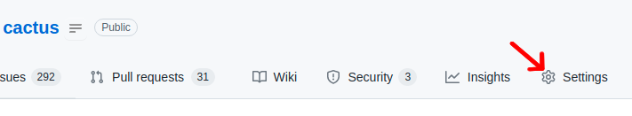
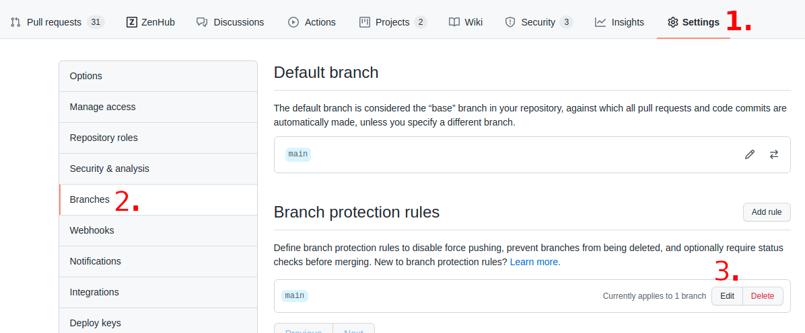
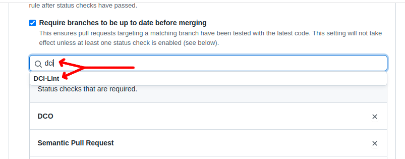
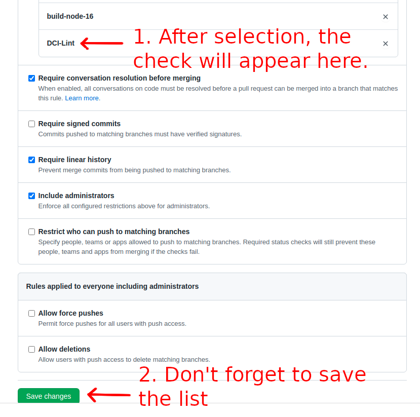

# DCI Lint GitHub Action

## Usage

> You have to have maintainer/admin rights on the GitHub repository where you are attempting to set up the DCI Lint GitHub Action

The YAML code snippet on the bottom [1] of this section demonstrates a
configuration that will automatically lint incoming pull requests for your repository. 

It was designed in a way so that you can safely copy paste 100% of the contents
without having to replace any of it with project-specific configuration parameters
as long as you are happy with the default recommendations of the Inclusive Naming Initiative's language guide [2] [3].

Once the job is added (e.g. the configuration has been committed to your repository), you will be able to navigate to 
1. Your GitHub project's settings `https://github.com/$YOUR_ORG/$YOUR_PROJECT/settings` 
   
   
2. Then to `Branches` -> `"Edit"` starting from the left hand side menu (or via `https://github.com/$YOUR_ORG/$YOUR_PROJECT/settings/branches`)
   
   
3. Then search for `"dci"` after which the result list should allow you to select the check as shown here:
   
   
4. Finally the `"DCI Lint"` check will appear in the list of enforced checks and you can click on `"Save Changes"` to persist the change you just made:
   
   

[1]:
```yaml
name: YourCoolProject_CI

# Triggers the workflow on push or pull request events
on:
  push:
    branches: [main]

  pull_request:
    branches: [main]

jobs:
  DCI-Lint:
    runs-on: ubuntu-20.04
    name: DCI-Lint
    steps:
    - name: Lint Git Repo
      id: lint-git-repo
      uses: petermetz/gh-action-dci-lint@v0.6.1
      with:
        lint-git-repo-request: '{"cloneUrl": "${{ github.server_url }}/${{ github.repository }}.git", "fetchArgs": ["--no-tags", "--prune", "--progress", "--no-recurse-submodules", "--depth=1", "origin" ,"+${{ github.sha }}:${{ github.ref }}"], "checkoutArgs": [ "${{ github.ref }}"], "targetPhrasePatterns": [], "configDefaultsUrl": "https://inclusivenaming.org/json/dci-lint-config-recommended-v1.json" }'
    - name: Get the output response
      run: echo "${{ steps.lint-git-repo.outputs.lint-git-repo-response }}"
```

[2]: https://inclusivenaming.org/word-lists/overview/
[3]: https://inclusivenaming.org/json/dci-lint-config-recommended-v1.json

## Special Thanks To

1. The Hyperledger Diversity Civility and Inclusion Work Group whom inspired me to work on DCI Lint and the corresponding GitHub Action
2. The Inclusive Naming Initiative who were kind enough to host the machine readable version of their language guide in a JSON file through their website
